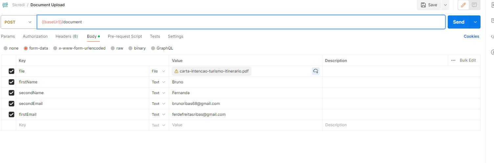

# Requisicao


# Response

```

{
    "id": 677123,
    "chave": "8EAAB0EA0F22C170",
    "signUrl": "https://sandbox.portaldeassinaturas.com.br/Assinatura/AssinarFrame/840444?chave=8EAAB0EA0F22C170&signer=257355",
    "inProcessing": false,
    "warnings": [],
    "attendees": [
        {
            "signerId": id,
            "name": "nome",
            "email": "email",
            "individualIdentificationCode": null,
            "order": 2,
            "action": "DIGITAL-SIGNATURE",
            "signUrl": "url",
        "batchSignUrl": ""
        },
        {
            "signerId": id,
            "name": "nome",
            "email": "email",
            "individualIdentificationCode": null,
            "order": 3,
            "action": "ELETRONIC-SIGNATURE",
            "signUrl": "url",
            "batchSignUrl": ""
        }
    ]
}
```

### Problema a ser resolvido

Boa tarde,

Nesta última fase do processo seletivo, iremos testar diversas habilidades que são importantes para o desempenho dos trabalhos, no dia-a-dia de um Assessor de Desenvolvimento de Sistemas na Sicredi Centro-Sul MS/BA.

Problema

Você deverá entender e desenvolver uma integração com uma API já existente e que possui documentação. A API é aberta em modelo Sandbox e você não necessita de informações especiais para prosseguir, bastando realizar o seu cadastro com o botão "Sign up" na tela inicial.

Recomendamos ler os itens do menu "HOW-TOS" antes de iniciar o desenvolvimento de código. O objetivo da API é enviar documentos para assinatura eletrônica. Endereço: https://desenvolvedor.portaldeassinaturas.com.br/ .

Iremos avaliar a clareza na construção, estruturação (código, pastas, packages), padrões de design e o emprego da orientação a objetos no código. Não é permitido utilizar bibliotecas terceiras ou frameworks, o projeto deve ser criado em PHP puro. Não é preciso criar interface gráfica do projeto ou conexão com o banco de dados, apenas devendo ser possível realizar testes das funcionalidades. Após a entrega, haverá uma entrevista técnica sobre o seu funcionamento, como foi construída e de que forma você chegou em determinada estrutura.

Iremos analisar o seu código através de um projeto github que você deverá criar e enviar até a data de 25/02/2024.